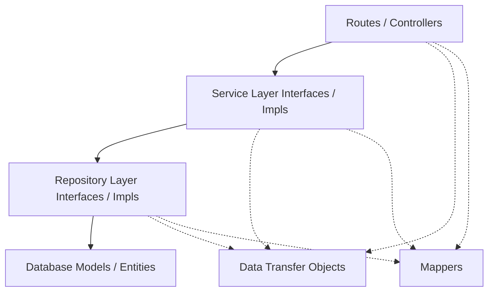

# Agentic Coding Standards & Architecture Guidelines

This document outlines the coding standards, architectural patterns, design principles, and formatting guidelines for the Hospital Management system. The objective is to maintain a highly readable, maintainable, testable, and clean codebase.

---

## 1. Directory Structure & Architecture

The project follows a layered architecture to achieve a clean separation of concerns:



- **Routes (`app/routes/`)**: Handle incoming HTTP requests, perform basic input validation, and delegate business processes to the Service layer.
- **Services (`app/services/`)**: Implement business rules, handle transactional logic, and mediate between controllers and repositories.
- **Repositories (`app/repositories/`)**: Encapsulate all database interaction and querying logic, separating data storage mechanisms from business rules.
- **Models (`app/models/`)**: Define database schemas and relationships using the ORM.
- **DTOs (`app/dtos/`)**: Strongly typed data structures used to pass data across system layers, preventing models from leaking into user interfaces.
- **Mappers (`app/mappers/`)**: Transform data between database models and DTOs.

---

## 2. Class File & Object Creation Standards

### Class File Structure
- **One Class per File**: Each file should contain exactly one primary class. The filename must represent the class name in snake_case (e.g., `PatientService` is defined in `patient_service.py`).
- **Imports Grouping**:
  1. Standard library imports.
  2. Third-party library imports (e.g., Flask, SQLAlchemy).
  3. Local project imports.
- **Explicit Type Annotations**: Every class attribute, method parameter, and return value must have explicit type annotations.

### Object Creation Guidelines
- Do not instantiate databases, repositories, or external services directly within local controller methods.
- **Dependency Inversion**: Dependencies must be referenced via their interfaces (where applicable) and instantiated cleanly at the module level or passed via constructor injection.
- **Use DTOs for Creation Requests**: Instantiation of entities from raw HTTP payload dictionaries should be mediated by a DTO request object and mapped explicitly.

```python
# GOOD: Clean instantiation using DTO and Mapper
dto = PatientCreateRequest(
    first_name=cleaned["first_name"],
    last_name=cleaned.get("last_name")
)
patient_model = PatientMapper.to_model(dto)
```

---

## 3. Design Patterns

The codebase employs several design patterns to solve common architectural challenges:

### A. Repository Pattern
Decouples the business logic layer from the data access layer.
- All query-related operations are hidden behind repository methods.
- Services do not write database queries directly.
- **Example**: `PatientRepository` extends `BaseRepository[Patient]` and implements `IPatientRepository`.

### B. Service Layer Pattern
Provides a set of entry points to the application's business behaviors.
- Enforces interfaces for all services (e.g., `IPatientService`) to allow easy mocking and testing.
- Coordinates database commits, audits, and business rules.

### C. Data Transfer Object (DTO) & Mapper Patterns
- **DTO**: A simple data carrier object without any business logic (e.g., `PatientResponse`). It defines a clear contract for inputs and outputs.
- **Mapper**: Isolates the conversion logic from both the service and model classes. This prevents model logic from polluting service code.

---

## 4. SOLID Principles

Every component in the codebase must adhere to the five SOLID principles:

| Principle | Description | Implementation in this Project |
| :--- | :--- | :--- |
| **S**ingle Responsibility | A class should have only one reason to change. | A controller only handles HTTP. A service only handles business rules. A repository only handles DB operations. |
| **O**pen/Closed | Open for extension, closed for modification. | Add new behavior by creating new implementations of service or repository interfaces rather than altering existing code. |
| **L**iskov Substitution | Subtypes must be substitutable for their base types. | Subclasses of `BaseRepository` or classes implementing `IPatientService` must adhere strictly to the signatures of their base interfaces. |
| **I**nterface Segregation | Many client-specific interfaces are better than one general-purpose interface. | Separate service interfaces (e.g., `IPatientService` vs `IAuthService`) to avoid forcing clients to depend on methods they do not use. |
| **D**ependency Inversion | Depend upon abstractions, not concretions. | High-level modules (services) depend on repository interfaces. They do not depend on the physical DB implementation. |

---

## 5. "No Method-in-Method" Policy

**Nested functions (defining a `def` inside another `def`) are strictly prohibited.**

### Why?
- **Readability**: Code is flatter, cleaner, and easier to scan.
- **Testability**: Nested helper functions cannot be unit tested in isolation.
- **Performance**: Nested functions are re-defined on every execution of the outer function.

### Standard Practice
If a method requires helper logic, extract that helper logic into:
1. A private or protected class method (prefixed with `_`).
2. A static helper function.
3. A separate utility module if it is generic.

### Examples

❌ **BAD: Nested Method**
```python
def process_patient_records(self, data: list) -> list:
    # A nested helper method - PROHIBITED
    def format_record(record: dict) -> dict:
        return {
            "id": record["id"],
            "name": record["name"].upper()
        }
    
    results = []
    for item in data:
        results.append(format_record(item))
    return results
```

Equivalent Clean Code:

      ✔ **GOOD: Extracted Private Method**
```python
def _format_record(self, record: dict) -> dict:
    """Format an individual patient record."""
    return {
        "id": record["id"],
        "name": record["name"].upper()
    }

def process_patient_records(self, data: list) -> list:
    """Process and format all patient records."""
    results = []
    for item in data:
        formatted = self._format_record(item)
        results.append(formatted)
    return results
```

---

## 6. Python Feature Constraints (No Obscure Python-Exclusive Features)

To make the codebase accessible, easy to translate to other languages, and structurally clean, avoid using obscure Python-specific hacks, magic features, and dynamic expressions.

### Prohibited Features & Hacks
1. **Dynamic Executions**: Do not use `eval()`, `exec()`, or runtime compilation.
2. **Implicit Local Contexts**: Do not use `locals()`, `globals()`, or `vars()` for parameter packing or unpacking.
3. **Excessive Dynamic Attribute Access**: Avoid using `setattr()` or `getattr()` for core business operations unless absolutely required in generic base classes.
4. **Obscure Metaprogramming**: Do not use custom metaclasses or override `__getattr__` or `__getattribute__` for business models or services.
5. **Vague Variable Arguments (`*args` and `**kwargs`)**: Avoid them in main API signatures. Every function parameters list should be explicitly named.
6. **Obscure Builtins**: Avoid functions like `filter(lambda ...)` or `map(lambda ...)` when standard list comprehensions or explicit loops are clearer.

### Examples

❌ **BAD: Obscure Dynamic Code**
```python
# Unpacking local context dynamically is forbidden
def update_profile(self, **kwargs) -> None:
    for key, value in kwargs.items():
        setattr(self, key, value) # Obscure, lacks compile-time checks
```

Equivalent Clean Code:

      ✔ **GOOD: Explicit & Strongly-Typed Code**
```python
# Explicit field assignments
def update_profile(self, first_name: str, last_name: str, phone: str) -> None:
    self.first_name = first_name
    self.last_name = last_name
    self.phone = phone
```

---

## 7. Expanded Line Formatting Rules

All code must be written in an **expanded and clear** format. Condensing multiple logical steps, inline conditionals, or assignments onto a single line is not permitted.

### Specific Rules
- **No Multi-statements**: Do not use semicolons `;` to combine multiple statements on one line.
- **No Inline Conditionals on the Same Line**: Always place the block body on a new indented line.
- **No Complex Nested Comprehensions**: Keep list comprehensions simple. If they span more than one loop or contain complex filters, convert them to standard multiline `for` loops.
- **Explicit Variable Assignments**: Assign complex intermediate expressions to variables with meaningful names before checking them or passing them to functions.

### Examples

❌ **BAD: Condenses and Compacted Code**
```python
# Single-line conditionals, inline logic and semi-colons are prohibited
if patient is None: return None; print("Error")
records = [r.id for r in patient.visits if r.status == 'Active' if r.amount > 100]
```

Equivalent Clean Code:

      ✔ **GOOD: Expanded and Clean Code**
```python
# Expanded formatting for readability
if patient is None:
    print("Error")
    return None

active_high_value_visits = []
for visit in patient.visits:
    if visit.status == 'Active' and visit.amount > 100:
        active_high_value_visits.append(visit.id)
```

---

## 8. Clean Code & Documentation Rules

- **Type Annotations**: Mandatory for all function signatures. Use standard typing types (`List`, `Dict`, `Optional`, `Any`, `Type`) to describe data structures.
- **Function/Method Docstrings**: Every function must begin with a docstring inside triple quotes `"""` explaining:
  - The purpose of the function.
  - Parameters (if not self-explanatory).
  - Return types and potential exceptions.
- **Variable Naming**:
  - Class names: `CamelCase` (e.g., `PatientRepository`).
  - Variables and Functions: `snake_case` (e.g., `get_patient_by_id`).
  - Constants: `UPPER_SNAKE_CASE` (e.g., `MAX_LOGIN_ATTEMPTS`).
- **No Placeholders**: Never commit placeholder comments or unimplemented placeholders (e.g., `# TODO: fix this later`). If a feature is not completed, log a clear ticket and describe the missing implementation.
