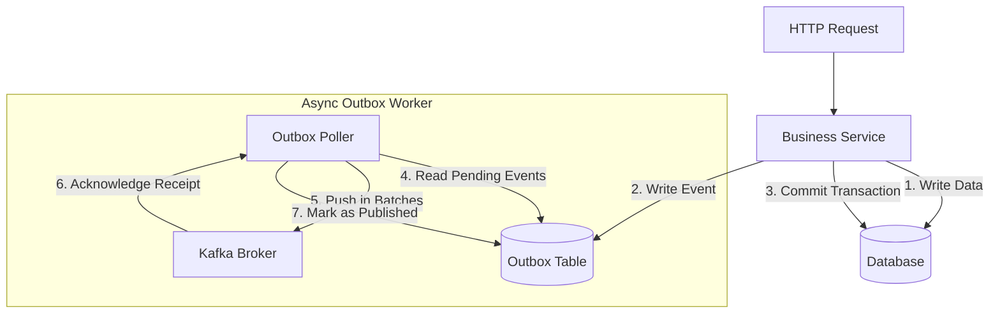

# Scalable Event Streaming Architecture: In-Memory to Kafka

This document outlines the blueprint and scaling guidelines for offloading event publishing from local in-memory event queues to an asynchronous, distributed event broker (Kafka) as the platform scales.

---

## 1. Target Architecture

As the system moves from a single-server deployment to a multi-node/clustered environment, event publishing must be decoupled from the HTTP request/response lifecycle.

---

## 2. Mitigation Strategies for Distributed Scaling

When transitioning to asynchronous Kafka publishing, we must address the following critical distributed systems challenges:

### A. Data Loss Mitigation (Transactional Outbox Pattern)
* **Problem**: Storing events strictly in-memory before publishing is fragile. If the server process restarts, crashes, or suffers an Out-of-Memory (OOM) event, buffered events are lost forever.
* **Solution**: Implement the **Transactional Outbox Pattern**:
  1. Add an `outbox_events` table to the database.
  2. Within the same database transaction as the business operation, write the corresponding event DTO as a serialized JSON row.
  3. A background process (e.g., using Celery, a daemon thread, or a separate service) polls this table, pushes the events to Kafka, and marks them as processed upon acknowledgment.
  4. This guarantees **At-Least-Once Delivery** with zero data loss.

### B. Backpressure and Memory Exhaustion (OOM)
* **Problem**: If the Kafka cluster is temporarily unreachable or experiences high latency, the publishing buffer will grow indefinitely, consuming all server memory and crashing the service.
* **Solution**: Implement **Bounded Queues & Overflow Policies**:
  1. Restrict the in-memory/in-transit buffer size to a fixed number of events (e.g., `max_size=10000`).
  2. Define an overflow policy:
     * **Block**: Pause the publishing thread until the buffer has free slots (safest for business-critical data).
     * **Reject / Error**: Throw a `QueueFullException` to let the client retry.
     * **Drop Oldest**: Discard older non-critical diagnostic/log events to prioritize system uptime.

### C. Event Ordering Preservation
* **Problem**: In a distributed setup with multiple publisher worker threads, events might arrive at Kafka out of order (e.g., a `RecordUpdated` event reaching Kafka before `RecordCreated`).
* **Solution**: Preserve partition affinity keys:
  1. Group events by their entity partition key (e.g., `tenant_id` or `record_id`).
  2. Ensure that all events belonging to the same key are routed to the **same Kafka partition** and written sequentially.

### D. Downstream Idempotency
* **Problem**: Due to network retries, duplicate events may be delivered to Kafka (At-Least-Once semantics).
* **Solution**: Downstream event consumers must be designed to be **idempotent**. They should keep track of processed event IDs (e.g., in a Redis cache or relational database table) and discard duplicate messages.
